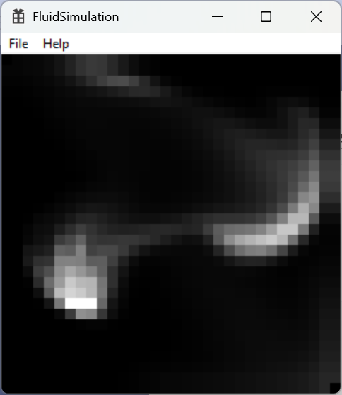

# Real-Time Fluid Dynamic Simulation

This repository implements the algorithm defined in the following whitepaper:

https://www.dgp.toronto.edu/public_user/stam/reality/Research/pdf/GDC03.pdf

## Whitepaper Abstract

In this paper we present a simple and rapid implementation of a fluid dynamics solver for game 
engines. Our tools can greatly enhance games by providing realistic fluid-like effects such as 
swirling smoke past a moving character. The potential applications are endless. Our algorithms 
are based on the physical equations of fluid flow, namely the Navier-Stokes equations. These 
equations are notoriously hard to solve when strict physical accuracy is of prime importance. 
Our solvers on the other hand are geared towards visual quality. Our emphasis is on stability 
and speed, which means that our simulations can be advanced with arbitrary time steps. We 
also demonstrate that our solvers are easy to code by providing a complete C code 
implementation in this paper. Our algorithms run in real-time for reasonable grid sizes in both 
two and three dimensions on standard PC hardware, as demonstrated during the presentation 
of this paper at the conference. 

